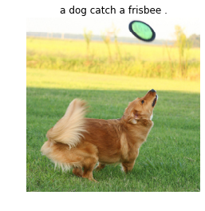

# _**Show, Attend and Tell: Neural Image Caption Generation with Visual Attention**_ in PyTorch

This repository contains PyTorch implementation of [Show, Attend and Tell](https://arxiv.org/abs/1502.03044)

### How to run

To train model form scratch, use following command.

```
python main.py
```

To train model following existing checkpoint, use following command.

```
python main.py --model_path MODEL_PATH
```

To generate caption of an image, use following command.

```
python main.py --test --model_path MODEL_PATH --image_path IMAGE_PATH
```

Lastly, to download required data (Flickr8k and GloVe, for now), use '--download' argument.


## Results

### Flickr8k dataset

Following examples are generated after training using Google Colaboratory for less than 7 hours. Training captions are lemmatized, thus so is generated captions. Therefore generated captions are not complete English sentence, but they are still interpretable. (Lemmatization helps training when resource is limited, because it reduces vocabulary size.)

* Correct examples


* Not 100% correct, but not totally wrong examples




* Wrong examples


